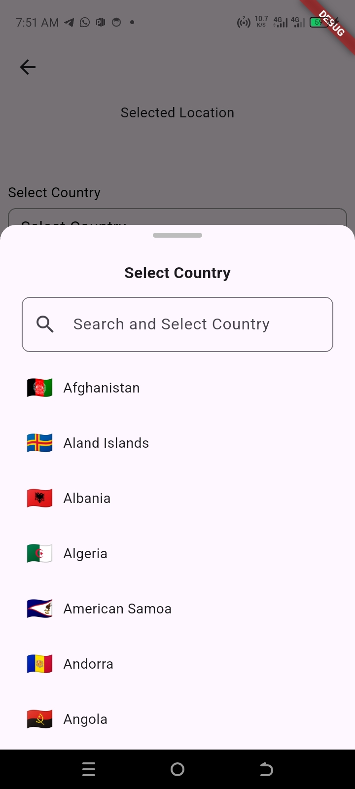
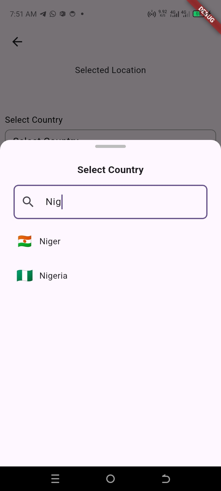
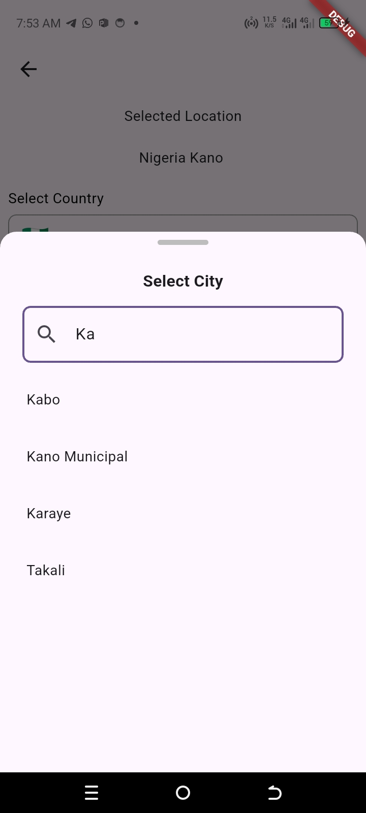
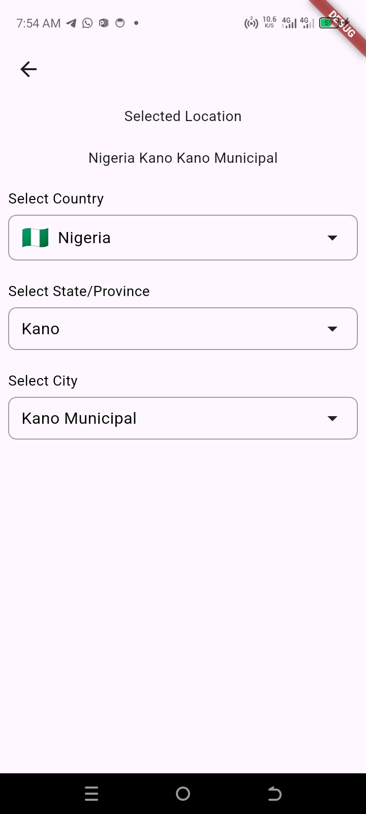
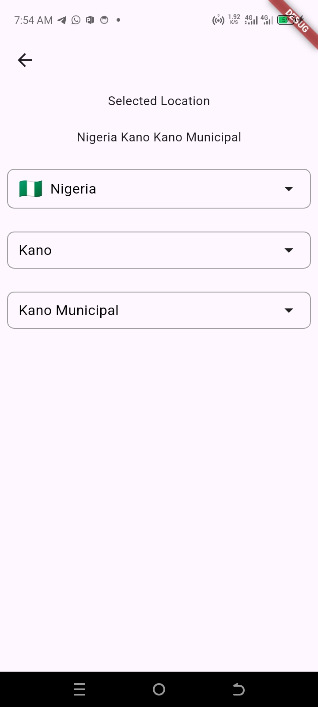

## 🌍 CountryStateCitySelector 

### A Customizable Flutter Picker

A **fully customizable, platform-adaptive Flutter widget** for selecting **Country, State/Province, and City**.  
Supports **optional callbacks**, **searchable pickers**, and **cross-platform UI** (iOS, Android, Web, macOS).

It works seamlessly across iOS, Android, Web, Windows, macOS, and Linux, adapting its design using Material and Cupertino widgets.


---

## Features

- Fully **customizable** UI: labels, text, colors, borders, modal, and list items.
- **Searchable pickers** for countries, states, and cities.
- Optional callbacks for:
  - `onSelectionChanged`
  - `onCountryChanged`
  - `onStateChanged`
  - `onCityChanged`
- Platform-adaptive modal:
  - iOS/macOS: `CupertinoModalPopup`
  - Android/Web: `showModalBottomSheet`
- Works on **Flutter 3+** and all screen sizes.
- Can disable labels or adjust styling per app theme.

---

### ✨ Description

✅ Correct Countries, States and Cities

✅ Country → State → City picker hierarchy

✅ Adaptive design (Material bottom sheet for Android/Web/Windows/Linux, Cupertino modal for iOS/macOS)

✅ Built-in search for countries, states, and cities

✅ Emoji flag support (if provided in JSON)

✅ Customizable labels, borders, colors, fonts, and modal styles

✅ Callbacks for selection changes at each level

✅ Lightweight – no external dependencies beyond Flutter


---

## 📦 Installation

Add the dependency to your `pubspec.yaml`:

```yaml
dependencies:
  country_state_city_selector: ^1.0.1
```

### Import
```dart
import 'package:country_state_city_selector/country_state_city_selector.dart';

```

## 📸 Screenshots









## 🚀 Usage

```dart
import 'package:country_state_city/country_state_city.dart';
import 'package:flutter/material.dart';

class TestingCountry extends StatefulWidget {
  const TestingCountry({super.key});

  @override
  State<TestingCountry> createState() => _TestingCountryState();
}

class _TestingCountryState extends State<TestingCountry> {
  String _country = '';
  String _state = '';
  String _city = '';

  String _submitted = '';

  @override
  Widget build(BuildContext context) {
    return Scaffold(
      appBar: AppBar(),
      body: Padding(
        padding: const EdgeInsets.all(8.0),
        child: Column(
          children: [
            Text("Selected Location"),
            Text(_submitted),
            Text("${_country} ${_state} ${_city}"),
            SizedBox(height: 20),

            CountryStateCitySelector(
              enableLabels: false,
              initialCountry: 'Nigeria',
              initialState: "Lagos",
              initialCity: "Ikeja",
              defaultCountry: 'Ghana',
              borderColor: Colors.amber,
              borderWidth: 2,
              fillColor: const Color(0xFFFFE8F0),
              labelColor: Colors.red,
              labelFontSize: 18,
              labelFontWeight: FontWeight.bold,
              selectedTextColor: Colors.green,
              selectedTextFontSize: 18,
              selectedTextFontWeight: FontWeight.bold,
              pickerItemTextColor: Colors.blue,
              pickerItemFontSize: 18,
              pickerItemFontWeight: FontWeight.bold,
              modalBackgroundColor: const Color.fromARGB(255, 96, 96, 96),
              modalTitleFontSize: 24,
              modalTitleColor: const Color(0xFFEAEAEA),
              modalTitleFontWeight: FontWeight.bold,
              countryHintText: 'My Country',
              stateHintText: 'My State',
              cityHintText: 'My Local Government',
              onSelectionChanged: (String country, String state, String city) {
                setState(() {
                  _country = country;
                  _state = state;
                  _city = city;
                });
              },
              onCountryChanged: (country) {
                print("User picked country: $country");
              },
              onStateChanged: (state) {
                print("User picked state: $state");
              },
              onCityChanged: (city) {
                print("User picked city: $city");
              },
            ),
          ],
        ),
      ),
    );
  }
}


```
## 🎨 Customization (Alphabetical, Example with Overrides)

| **Property**             | **Description**                        | **Example Value** |
|--------------------------|--------------------------------------  |------------|
| `borderColor`            | Border color of selection boxes        | `Colors.amber` |
| `borderWidth`            | Border width of selection boxes        | `2` |
| `countryHintText`        | Hint text for country                  | `"My Country"` |
| `stateHintText`          | Hint text for state                    | `"My State"` |
| `cityHintText`           | Hint text for city                     | `"My Local Government"` |
| `defaultCountry`         | Fallback country if none selected      | `"Ghana"` |
| `initialCountry`         | Pre-selected country                   | `"Nigeria"` |
| `initialState`           | Pre-selected state                     | `"Lagos"` |
| `initialCity`            | Pre-selected city                      | `"Ikeja"` |
| `enableLabels`           | Show/hide labels above pickers         | `false` |
| `fillColor`              | Background color of selection boxes    | `Color(0xFFFFE8F0)` |
| `labelColor`             | Label text color                       | `Colors.red` |
| `labelFontSize`          | Label font size                        | `18` |
| `labelFontWeight`        | Label font weight                      | `FontWeight.bold` |
| `modalBackgroundColor`   | Modal background                       | `Color(0xFF606060)` |
| `modalTitleColor`        | Title color in modal                   | `Color(0xFFEAEAEA)` |
| `modalTitleFontSize`     | Modal title size                       | `24` |
| `modalTitleFontWeight`   | Modal title weight                     | `FontWeight.bold` |
| `pickerItemFontSize`     | List item font size in modal           | `18` |
| `pickerItemFontWeight`   | List item font weight in modal         | `FontWeight.bold` |
| `pickerItemTextColor`    | List item text color in modal          | `Colors.blue` |
| `selectedTextColor`      | Text color of selected item            | `Colors.green` |
| `selectedTextFontSize`   | Selected text font size                | `18` |
| `selectedTextFontWeight` | Selected text font weight              | `FontWeight.bold` |


### 📱 Platform Adaptation

- iOS / macOS → Cupertino modal bottom sheet + CupertinoSearchTextField
- Android / Web / Windows / Linux → Material modal bottom sheet + TextField
- This ensures the widget looks native on every platform.

### 🛠 Callbacks

- onSelectionChanged(String country, String state, String city) → triggered whenever any level changes
- onCountryChanged(String country) → triggered when a country is selected
- onStateChanged(String state) → triggered when a state is selected

- onCityChanged(String city) → triggered when a city is selected


## ✅ Conclusion

The CountryStateCitySelector widget is a plug-and-play, customizable, adaptive solution for selecting countries, states, and cities in your Flutter app.
It’s super flexible for all kind of apps such as for e-commerce apps, form builders, government apps, and location-based services.

## Connect with
Wisdom Ugochukwu
wisdomscode@gmail.com


