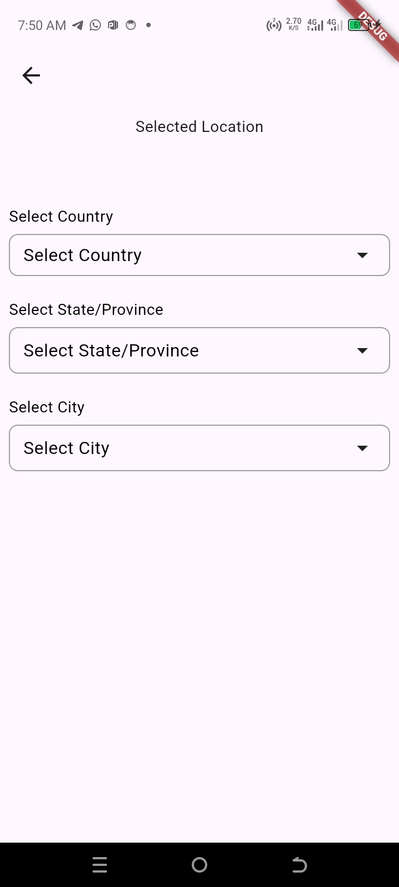
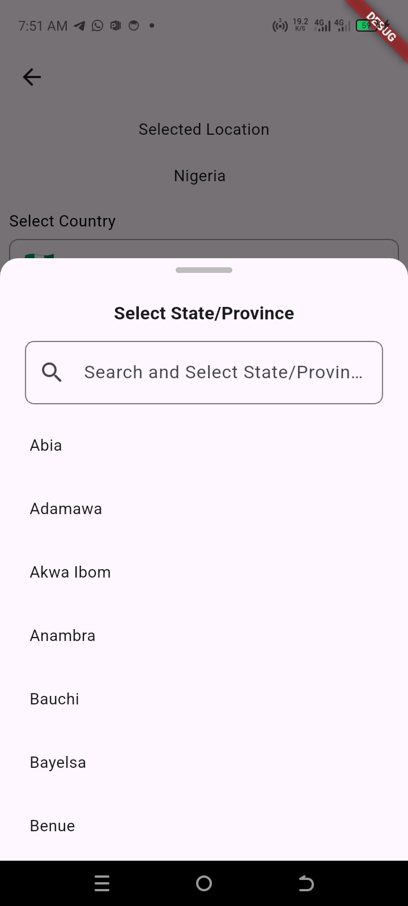
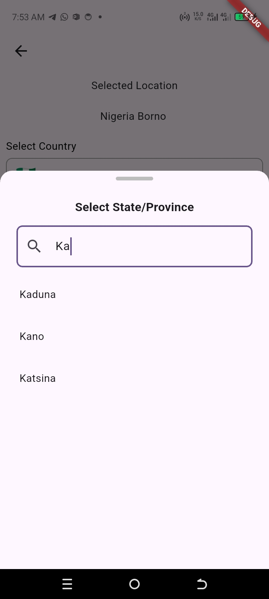
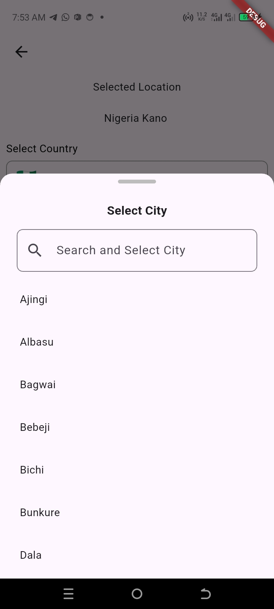

# 🌍 CountryStateCitySelector – A Customizable Flutter Picker


A **fully customizable, platform-adaptive Flutter widget** for selecting **Country, State/Province, and City**.  
Supports **optional callbacks**, **searchable pickers**, and **cross-platform UI** (iOS, Android, Web, macOS).

It works seamlessly across iOS, Android, Web, Windows, macOS, and Linux, adapting its design using Material and Cupertino widgets.

---

---

## Features

- Fully **customizable** UI: labels, text, colors, borders, modal, and list items.
- **Searchable pickers** for countries, states, and cities.
- Optional callbacks for:
  - `onSelectionChanged`
  - `onCountryChanged`
  - `onStateChanged`
  - `onCityChanged`
- Platform-adaptive modal:
  - iOS/macOS: `CupertinoModalPopup`
  - Android/Web: `showModalBottomSheet`
- Works on **Flutter 3+** and all screen sizes.
- Can disable labels or adjust styling per app theme.

---

### ✨ Description

✅ Correct Countries, States and Cities

✅ Country → State → City picker hierarchy

✅ Adaptive design (Material bottom sheet for Android/Web/Windows/Linux, Cupertino modal for iOS/macOS)

✅ Built-in search for countries, states, and cities

✅ Emoji flag support (if provided in JSON)

✅ Customizable labels, borders, colors, fonts, and modal styles

✅ Callbacks for selection changes at each level

✅ Lightweight – no external dependencies beyond Flutter

---

## 📸 Screenshots
 
 
 
 
 

 
 


---

## 📦 Installation

Add the dependency to your `pubspec.yaml`:

```yaml
dependencies:
  country_state_city_selector:
    git:
      url: https://github.com/wisdomscode/country_state_city_selector.git
      ref: main
```

## 🚀 Usage

```dart
import 'package:flutter/material.dart';
import 'package:country_state_city_selector/country_state_city_selector.dart';

class MyHomePage extends StatefulWidget {
  @override
  State<MyHomePage> createState() => _MyHomePageState();
}

class _MyHomePageState extends State<MyHomePage> {
  String _country = '';
  String _state = '';
  String _city = '';

  @override
  Widget build(BuildContext context) {
    return Scaffold(
      appBar: AppBar(title: Text("Country State City Selector")),
      body: Padding(
        padding: const EdgeInsets.all(16.0),
        child: CountryStateCitySelector(
          enableLabels: true,
          borderColor: Colors.amber,
          borderWidth: 2,
          fillColor: const Color(0xFFFFE8F0),
          labelColor: Colors.red,
          labelFontSize: 18,
          labelFontWeight: FontWeight.bold,
          selectedTextColor: Colors.green,
          selectedTextFontSize: 18,
          selectedTextFontWeight: FontWeight.bold,
          pickerItemTextColor: Colors.blue,
          pickerItemFontSize: 18,
          pickerItemFontWeight: FontWeight.bold,
          modalBackgroundColor: const Color(0xFFEEEEEE),
          modalTitleFontSize: 24,
          modalTitleColor: Colors.orange,
          modalTitleFontWeight: FontWeight.bold,
          countryHintText: 'My Country',
          stateHintText: 'My State',
          cityHintText: 'My Local Government',
          onSelectionChanged: (String country, String state, String city) {
            setState(() {
              _country = country;
              _state = state;
              _city = city;
            });
          },
          onCountryChanged: (country) {
            print("User picked country: $country");
          },
          onStateChanged: (state) {
            print("User picked state: $state");
          },
          onCityChanged: (city) {
            print("User picked city: $city");
          },
        ),
      ),
    );
  }
}

```

🎨 Customization
- Property	Description	Default
- enableLabels	Show/hide labels above pickers	true
- borderColor	Border color of selection boxes	Colors.grey
- borderWidth	Border width of selection boxes	1.0
- fillColor	Background color of selection boxes	Colors.transparent
- labelColor	Label text color	Colors.black
- labelFontSize	Label font size	14
- labelFontWeight	Label font weight	FontWeight.normal
- countryHintText	Hint text for country	"Select Country"
- stateHintText	Hint text for state	"Select State/Province"
- cityHintText	Hint text for city	"Select City"
- selectedTextColor	Text color of selected item	Colors.black
- selectedTextFontSize	Selected text font size	16
- selectedTextFontWeight	Selected text font weight	FontWeight.normal
- pickerItemTextColor	List item text color in modal	Colors.black
- pickerItemFontSize	List item font size in modal	16
- pickerItemFontWeight	List item font weight	FontWeight.normal
- modalBackgroundColor	Modal background	Color(0xFFFFFFFF)
- modalTitleColor	Title color in modal	Colors.black
- modalTitleFontSize	Modal title size	18
- modalTitleFontWeight	Modal title weight	FontWeight.bold

### 📱 Platform Adaptation

- iOS / macOS → Cupertino modal bottom sheet + CupertinoSearchTextField
- Android / Web / Windows / Linux → Material modal bottom sheet + TextField
- This ensures the widget looks native on every platform.

### 🛠 Callbacks

- onSelectionChanged(String country, String state, String city) → triggered whenever any level changes
- onCountryChanged(String country) → triggered when a country is selected
- onStateChanged(String state) → triggered when a state is selected

- onCityChanged(String city) → triggered when a city is selected


## ✅ Conclusion

The CountryStateCitySelector widget is a plug-and-play, customizable, adaptive solution for selecting countries, states, and cities in your Flutter app.
It’s super flexible for all kind of apps such as for e-commerce apps, form builders, government apps, and location-based services.

## Connect with
Wisdom Ugochukwu
wisdomscode@gmail.com